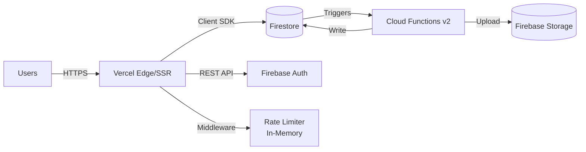

# 📊 Phân Tích Năng Lực Hệ Thống VAA Job Platform

> Dựa trên cấu hình hiện tại: **Firebase Blaze (pay-as-you-go)** + **Vercel Hobby (free)**

---

## 1. Kiến Trúc Hiện Tại



| Thành phần | Vai trò | Giao thức |
|------------|---------|-----------|
| **Vercel** | Hosting, SSR, API routes, Middleware | HTTPS |
| **Firestore** | Database chính (documents) | Client SDK (trực tiếp từ browser) |
| **Firebase Auth** | Xác thực người dùng | REST API |
| **Cloud Functions v2** | Triggers (8 functions), PDF gen, payment logic | Event-driven |
| **Firebase Storage** | Lưu PDF hợp đồng | Upload from Cloud Functions |
| **SWR Cache** | In-memory client-side cache, LRU, max 500 entries | Local |

---

## 2. Bottleneck Analysis — Điểm Nghẽn

### 🔴 Bottleneck #1: Vercel Hobby (NẮP CỨNG — Hard Cap)

| Tài nguyên | Giới hạn/tháng | Hệ quả khi hết |
|------------|----------------|-----------------|
| **Bandwidth** | 100 GB | ❌ Site ngừng phục vụ |
| **Edge Requests** | 1,000,000 | ❌ Site ngừng phục vụ |
| **Serverless Invocations** | 1,000,000 | ❌ API routes ngừng |
| **CPU Time** | 4 CPU-hours | ❌ SSR ngừng |
| **Deployments** | 100/ngày | ⚠️ Không deploy được |
| **Function Duration** | 300s max | ⚠️ Long tasks timeout |
| **Payload Size** | 4.5 MB | ⚠️ Large responses bị cắt |

> [!CAUTION]
> **Vercel Hobby là nắp cứng** — khi hết quota, service DỪNG hoàn toàn, không tự scale. Đây là bottleneck nguy hiểm nhất.

### 🟡 Bottleneck #2: Middleware Rate Limiter (In-Memory)

```
Rate Limit Config hiện tại:
├── Auth API POST:  30 req / 5 min / IP
├── API routes:     60 req / 1 min / IP  
└── General:       120 req / 1 min / IP
```

**Vấn đề**: Rate limiter dùng `Map` in-memory trên Edge. Vercel Hobby có thể spin multiple isolates → mỗi isolate có `Map` riêng → rate limit không chính xác khi scale.

### 🟢 Bottleneck #3: Firestore (Gần như Không Giới Hạn)

| Tài nguyên | Giới hạn | Free quota/ngày |
|------------|----------|-----------------|
| **Reads** | Không giới hạn (trả phí) | 50,000/ngày miễn phí |
| **Writes** | Không giới hạn | 20,000/ngày miễn phí |
| **Deletes** | Không giới hạn | 20,000/ngày miễn phí |
| **Storage** | Không giới hạn | 1 GB miễn phí |
| **Concurrent Connections** | **Không giới hạn** | ♾️ |
| **Throughput** | 10,000 writes/sec (per DB) | — |

### 🟢 Bottleneck #4: Cloud Functions v2

| Tài nguyên | Free tier/tháng | Giới hạn hard |
|------------|----------------|---------------|
| **Invocations** | 2,000,000 | Trả phí sau đó |
| **Compute** | 400K GB-sec | Trả phí sau đó |
| **Networking** | 5 GB outbound | Trả phí sau đó |
| **Concurrent instances** | 1,000 (default) | Configurable |

---

## 3. Tính Toán CCU & User Capacity

### Giả định sử dụng cho 1 user session

| Hành động | Requests/Session | Firestore Ops |
|-----------|-----------------|---------------|
| Đăng nhập (Auth + Session API) | 2 Vercel reqs | 1 read |
| Load Dashboard | 1 SSR + 3-5 client fetches | 5-10 reads |
| Duyệt Jobs (mỗi trang) | 1 req | 10-20 reads |
| Apply Job | 1 req | 2 writes + 3 reads |
| Chat (mở trang) | 1 req + 1 onSnapshot | 5 reads + continuous |
| Notification subscription | 1 onSnapshot | continuous reads |
| **Trung bình/phiên (15 phút)** | **~15-25 Vercel requests** | **~30-50 Firestore reads, 2-5 writes** |

### Capacity theo từng tầng

#### Tầng 1: Vercel Hobby (BOTTLENECK CHÍNH)

```
1,000,000 edge requests/tháng
÷ 30 ngày = ~33,333 requests/ngày
÷ 20 requests/user/session = ~1,666 sessions/ngày

Nếu mỗi user dùng 2 sessions/ngày:
→ ~830 DAU (Daily Active Users)

CCU peak (giả sử 10% DAU online cùng lúc):
→ ~80-100 CCU
```

> [!IMPORTANT]
> **Vercel Hobby hỗ trợ tối đa ~800 DAU, ~80-100 CCU** trước khi hết edge request quota.

#### Tầng 2: Firestore (Rất Thoải Mái)

```
Free quota: 50,000 reads/ngày
÷ 40 reads/user/session ÷ 2 sessions = ~625 DAU miễn phí

Blaze pay-as-you-go:
$0.06 / 100,000 reads
→ 1,000 DAU × 80 reads/ngày = 80K reads = $0.048/ngày ≈ $1.5/tháng

→ Firestore KHÔNG phải bottleneck. Scale đến 10,000+ DAU vẫn chỉ ~$15/tháng
```

#### Tầng 3: Cloud Functions

```
8 trigger-based functions
Mỗi job lifecycle: ~5-10 function invocations

2,000,000 free invocations/tháng
÷ 30 = ~66,666/ngày

→ Chịu được 6,600-13,300 job events/ngày miễn phí
→ Rất thoải mái cho 1,000+ DAU
```

#### Tầng 4: Firebase Auth

```
Free: Không giới hạn cho Email/Password
→ KHÔNG phải bottleneck
```

---

## 4. Tổng Kết Capacity Hiện Tại

```
┌─────────────────────────────────────────────────┐
│          CẤU HÌNH HIỆN TẠI (Firebase Blaze +    │
│                  Vercel Free)                    │
├─────────────────────────────────────────────────┤
│                                                 │
│   📊 Max Registered Users:  Không giới hạn      │
│   👥 Max DAU:               ~800                │
│   ⚡ Max CCU (peak):        ~80-100             │
│   📡 Max Requests/ngày:     ~33,000             │
│   💰 Chi phí:               $0/tháng (*)        │
│                                                 │
│   (*) Nếu vượt Firestore free tier: ~$1-5/tháng │
│                                                 │
│   🔴 BOTTLENECK: Vercel Hobby bandwidth/reqs    │
│                                                 │
└─────────────────────────────────────────────────┘
```

> [!NOTE]
> Con số thực tế có thể cao hơn nhờ:
> - **SWR Cache** giảm Firestore reads 30-60%
> - **Static pages** (ISR) giảm Vercel SSR load
> - **Firestore Client SDK** kết nối trực tiếp, bypass Vercel cho data fetching

---

## 5. Realtime Listeners — Đánh Giá Chi Phí Ẩn

Hệ thống có **3 onSnapshot listeners** đang active:

| Listener | Trang | Ước tính reads/phút/user |
|----------|-------|--------------------------|
| `subscribeToNotifications` | Freelancer dashboard | ~2-5 |
| `subscribeToConversations` | Jobmaster chat | ~5-10 |
| `subscribeToConversations` | Freelancer chat | ~5-10 |

> [!WARNING]
> **Realtime listeners là chi phí ẩn lớn nhất.** Mỗi snapshot change = 1 read cho *mỗi document* thay đổi.
> 
> - 50 CCU × 5 reads/phút = 250 reads/phút = **360,000 reads/ngày**
> - Vượt free tier nhanh, nhưng chi phí Blaze chỉ ~$0.22/ngày ≈ **$6.5/tháng**

---

## 6. Lộ Trình Nâng Cấp Theo Giai Đoạn

### 📋 Phase 0 — Hiện tại (MVP / Internal)
**0-50 users, 10-20 CCU**

| Dịch vụ | Plan | Chi phí |
|---------|------|---------|
| Vercel | Hobby (Free) | $0 |
| Firebase | Blaze (pay-as-you-go) | ~$0-5 |
| **Tổng** | | **~$0-5/tháng** |

✅ Phù hợp cho giai đoạn nội bộ, test, pilot.

---

### 📋 Phase 1 — Early Production (Mở rộng sớm)
**50-500 users, 50-100 CCU**

| Thay đổi | Lý do | Chi phí |
|----------|-------|---------|
| **Vercel Pro** ($20/tháng) | Tăng bandwidth lên 1TB, 1M→∞ functions | $20 |
| Firebase Blaze | Mức sử dụng tăng | ~$5-15 |
| **Tổng** | | **~$25-35/tháng** |

**Actions cần làm:**
- [ ] Nâng Vercel lên Pro plan
- [ ] Thêm Vercel Analytics để monitor
- [ ] Cân nhắc thêm Redis (Upstash) cho rate limiting chính xác
- [ ] Set Firebase Budget Alert: $20/tháng

---

### 📋 Phase 2 — Growth (Phát triển)
**500-5,000 users, 200-500 CCU**

| Thay đổi | Lý do | Chi phí |
|----------|-------|---------|
| Vercel Pro | Stable | $20 |
| Firebase Blaze | Reads tăng đáng kể | ~$20-50 |
| **Upstash Redis** | Rate limiting, session cache | $10 |
| **Domain + SSL** | Branding | ~$10/năm |
| **Tổng** | | **~$50-80/tháng** |

**Actions cần làm:**
- [ ] Migrate rate limiter sang Redis (Upstash/Vercel KV)
- [ ] Optimize Firestore reads: compound queries, pagination
- [ ] Tăng SWR cache TTL cho data ít thay đổi
- [ ] Implement incremental static regeneration (ISR) cho job listings
- [ ] Set Firebase Budget Alert: $50/tháng

---

### 📋 Phase 3 — Scale (Mở rộng lớn)
**5,000-50,000 users, 500-2,000 CCU**

| Thay đổi | Lý do | Chi phí |
|----------|-------|---------|
| **Vercel Enterprise** hoặc self-host | Full control | $100-400 |
| Firebase Blaze | Heavy usage | ~$50-200 |
| **CDN (Cloudflare)** | Edge caching, DDoS protection | $20 |
| Redis | Rate limit, Session, Cache | $25 |
| **Tổng** | | **~$200-650/tháng** |

**Actions cần làm:**
- [ ] Replace onSnapshot → polling + push notifications (FCM)
- [ ] Add Cloudflare CDN in front of Vercel
- [ ] Firestore composite indexes optimization
- [ ] Implement server-side data aggregation (Cloud Functions)
- [ ] Consider Firestore Bundle for static-ish data
- [ ] Set Firebase Budget Alert: $200/tháng

---

### 📋 Phase 4 — Enterprise
**50,000+ users, 2,000+ CCU**

| Thay đổi | Chi phí |
|----------|---------|
| Cloud Run (self-hosted) hoặc GKE | $200-1000 |
| Firebase Blaze + caching layer | ~$200-500 |
| CloudSQL (cho reporting/analytics) | $50-200 |
| Full CDN + WAF | $50-100 |
| **Tổng** | **~$500-1,800/tháng** |

---

## 7. So Sánh Chi Phí Theo CCU

| CCU | DAU (est.) | Vercel | Firebase | Tổng/tháng |
|-----|-----------|--------|----------|------------|
| 10 | 100 | Free | ~$0 | **$0** |
| 50 | 500 | Free (sát limit) | ~$3 | **$3** |
| 100 | 800 | **⚠️ HẾT QUOTA** | ~$5 | **Cần nâng cấp** |
| 100 | 1,000 | Pro ($20) | ~$8 | **$28** |
| 300 | 3,000 | Pro ($20) | ~$25 | **$45** |
| 500 | 5,000 | Pro ($20) | ~$50 | **$70** |
| 1,000 | 10,000 | Enterprise | ~$100 | **$200+** |

---

## 8. Khuyến Nghị Ngay Bây Giờ

> [!TIP]
> **Giai đoạn hiện tại (< 50 users)**: Cấu hình hiện tại **đủ dùng hoàn toàn**. Không cần chi thêm.

Tuy nhiên, **chuẩn bị sẵn** trước khi scale:

1. **Monitor Usage**: Theo dõi Vercel Usage Dashboard hàng tuần
2. **Set Budget Alerts** trên Firebase Console: $10 → $20 → $50
3. **Khi DAU vượt 500**: Nâng Vercel lên Pro ($20/tháng) — đây là nâng cấp có ROI cao nhất
4. **Khi DAU vượt 2,000**: Thêm Redis cho rate limiting + caching layer

---

## 9. Risk Assessment

| Rủi ro | Xác suất | Impact | Giải pháp |
|--------|----------|--------|-----------|
| Vercel hết bandwidth | Trung bình | 🔴 Critical — site chết | Monitor, nâng Pro |
| Firestore cost spike (onSnapshot) | Thấp | 🟡 Tăng bill | Budget alert |
| DDoS attack | Thấp | 🔴 Rate limiter in-memory không đủ | Cloudflare + Redis |
| Cloud Functions cold start | Trung bình | 🟡 Delay 2-5s | Min instances = 1 |
| Firebase Auth rate limit | Rất thấp | 🟢 Nhỏ | Đã fix middleware |

---

*Phân tích này dựa trên cấu hình thực tế của codebase VAA Job Platform tính đến 2026-04-06. Các con số là ước tính dựa trên usage patterns điển hình của ứng dụng B2B recruitment platform.*
