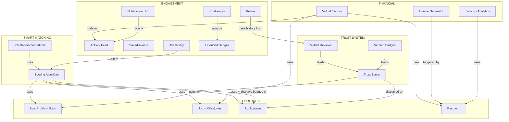

# VAA JOB — Feature Enhancement Implementation Plan (v2.0)

Phân tích 7 nhóm tính năng được đề xuất, đối chiếu với hệ thống hiện tại, đánh giá tính khả thi và lên kế hoạch triển khai chi tiết.

---

## 📊 Tổng Quan Đánh Giá

| # | Nhóm tính năng | Đánh giá | Khả thi | Ưu tiên |
|---|---------------|----------|---------|---------|
| 1 | Smart Matching & Recommendation | ⭐ Rất phù hợp | ✅ Cao | 🔴 P0 |
| 2 | Deadline & Timeline Management | 🔧 Nâng cấp cái có | ✅ Cao | 🔴 P0 |
| 3 | Trust & Reputation System | ⭐ Rất phù hợp + đã có nền | ✅ Cao | 🟡 P1 |
| 4 | Communication & Collaboration | 🔧 Hầu hết dùng cái có | ✅ Cao (4.1, 4.2) / ⚠️ Trung bình (4.3) | 🟡 P1 |
| 5 | Financial Features | ⭐ Core value | ✅ Cao | 🔴 P0 |
| 6 | Features từ nền tảng lớn | ⭐ Rất phù hợp | ✅ Cao | 🟡 P1 |
| 7 | Gamification mở rộng | 🎯 Nice-to-have | ✅ Trung bình | 🟢 P2 |

---

## Hệ Thống Hiện Tại — Đã Có Gì?

Trước khi đi vào chi tiết, tóm tắt nền tảng đã xây:

| Component | Status | Ghi chú |
|-----------|--------|---------|
| **User system** | ✅ Hoàn chỉnh | 4 roles, KYC, level L1-L5, specialties, software, stats denormalized |
| **Job system** | ✅ Hoàn chỉnh | Full CRUD, job state machine, milestones, checklist, attachments |
| **Application** | ✅ Hoàn chỉnh | Apply, shortlist, accept/reject, pagination |
| **Contract** | ✅ Hoàn chỉnh | Create, sign, PDF generation |
| **Payment** | ✅ Hoàn chỉnh | Milestone-based, approval workflow (JM → Accountant) |
| **Chat** | ✅ Hoàn chỉnh | Real-time messaging, file sharing |
| **Notifications** | ✅ Cơ bản | Real-time subscription, mark read, nhưng flat list |
| **Reviews** | ✅ Cơ bản | Star rating + categories (quality, communication, timeliness, professionalism) + comment, **nhưng chỉ 1 chiều** |
| **Disputes** | ✅ Cơ bản | Create, resolve, escalate workflow |
| **Badges** | ✅ Cơ bản | 5 badge types: `top_earner`, `speed_master`, `5_stars`, `loyal_partner`, `rising_star` |
| **Leaderboard** | ✅ Hoàn chỉnh | Monthly aggregation, public display |
| **Analytics** | ✅ Hoàn chỉnh | Revenue, jobs, applications, conversion, disputes — admin only |
| **Audit log** | ✅ Hoàn chỉnh | Action tracking, Firestore rules |
| **Security** | ✅ Hoàn chỉnh | CSRF, encryption, sanitization, storage rules, state machine |
| **Caching** | ✅ Hoàn chỉnh | SWR cache with TTL, retry logic |

---

## User Review Required

> [!IMPORTANT]
> **Phạm vi triển khai**: Đây là ~20+ tính năng mới/nâng cấp. Tôi đề xuất chia thành **4 Phase** (mỗi phase ~1-2 tuần), mỗi phase build + test + review trước khi tiếp tục. Bạn có đồng ý với cách tiếp cận này?

> [!IMPORTANT]
> **Cloud Functions**: Một số tính năng (Smart Matching scoring, scheduled alerts, auto-progress, invoice generation) cần Cloud Functions. Hiện chưa có thư mục `functions/src` trong repo. Bạn muốn tôi tạo mới hay bạn đã có ở repo khác?

> [!WARNING]
> **Tính năng 4.3 (Video Call)**: Tích hợp Google Meet API cần Google Workspace account + OAuth consent screen. Chi phí phát sinh nếu dùng nhiều. Tôi suggest dùng **auto-generate Google Meet link** đơn giản (button tạo link Meet → mở tab mới) thay vì embed video call.

> [!IMPORTANT]
> **Tính năng 5.2 (Invoice PDF)**: Cần confirm template hóa đơn (mẫu nào phù hợp với doanh nghiệp). Tôi có thể tạo template mặc định với Thông tin 2 bên, số HĐ, mục đích, số tiền.

---

## Proposed Changes — Chi Tiết Từng Tính Năng

### Phase 1: Smart Matching + Deadline + Escrow (P0 — Core Value)

Đây là 3 tính năng tạo giá trị khác biệt lớn nhất.

---

### 1.1 Auto-Rank Ứng Viên — Scoring Algorithm

**Đánh giá**: ⭐ Rất phù hợp. Data model hiện tại **đã đủ** tất cả input cần thiết:
- `UserProfile.specialties` + `UserProfile.software` → SkillMatch
- `UserProfile.currentLevel` → LevelMatch
- `UserProfile.stats.completedJobs` + `Job.category` → HistoryScore
- Logic check jobs đang active → AvailabilityScore
- `JobApplication.expectedFee` vs `Job.totalFee` → PriceScore
- `UserProfile.stats.avgRating` + `UserProfile.stats.onTimeRate` → RatingScore

#### [NEW] `app/src/lib/matching/scoring.ts`

```typescript
// Core scoring function
Score = w1×SkillMatch + w2×LevelMatch + w3×HistoryScore 
      + w4×AvailabilityScore + w5×PriceScore + w6×RatingScore

// Weights (configurable via system_config)
w1=0.25, w2=0.15, w3=0.20, w4=0.10, w5=0.15, w6=0.15
```

- `calculateApplicantScore(application, job, userProfile)` → 0-100 score
- `rankApplicants(applications[], job)` → sorted with scores + reasons
- `generateMatchReason(scores)` → "5 năm kinh nghiệm MEP, đã hoàn thành 12 dự án tương tự"

#### [MODIFY] `app/src/types/index.ts`
- Extend `JobApplication` với `matchScore?: number`, `matchBadge?: 'top_match' | 'recommended'`, `matchReasons?: string[]`

#### [MODIFY] Application list UI (jobmaster/admin)
- Hiển thị badge "Top Match" 🏆 / "Recommended" ⭐ bên cạnh ứng viên
- Sort mặc định theo matchScore desc
- Tooltip hiển thị lý do match

#### [NEW] `app/src/lib/matching/scoring.test.ts`
- Unit tests cho scoring algorithm

---

### 1.2 Job Recommendation cho Freelancer

**Đánh giá**: ⭐ Logic tự nhiên khi đã có scoring engine.

#### [NEW] `app/src/lib/matching/recommendation.ts`
- `getRecommendedJobs(userProfile)` — dùng scoring algorithm ngược lại (match freelancer → jobs)
- Factors: specialties match, level match, software match, past categories, availability
- Returns top 5 jobs với match % và lý do

#### [MODIFY] Freelancer Dashboard (`app/src/app/(role)/freelancer/page.tsx`)
- Thêm section "🎯 Việc làm phù hợp với bạn" sau metrics grid
- Card layout với match % indicator + "Vì sao phù hợp" tooltip
- Link "Xem thêm" → trang jobs đã filter sẵn

#### [MODIFY] Notification system
- Thêm notification type `job_recommended` khi có job mới match >80%

---

### 2.1 Smart Deadline Alert System (Multi-tier)

**Đánh giá**: 🔧 Nâng cấp. Hiện đã có notification type `deadline_warning`. Cần mở rộng logic.

| Thời điểm | Kênh | Notification Type |
|-----------|------|-------------------|
| 7 ngày trước | In-app | `deadline_7days` |
| 3 ngày trước | In-app + Email | `deadline_3days` |
| 1 ngày trước | In-app + Email | `deadline_1day` |
| Quá hạn | In-app + Email + Escalate | `deadline_overdue` |

#### [MODIFY] `app/src/types/index.ts`
- Mở rộng `NotificationType` thêm: `'deadline_7days' | 'deadline_3days' | 'deadline_1day' | 'deadline_overdue'`

#### [NEW/MODIFY] Cloud Function `scheduledDeadlineCheck`
- Thay đổi logic check: duyệt tất cả jobs `in_progress` / `review`
- Tính thời gian còn lại = `job.deadline - now`
- Gửi notification theo tier, kèm `progress` hiện tại
- Nội dung: "Còn X ngày để hoàn thành [Job]. Progress hiện tại: Y%"
- Quá hạn: auto-create notification cho Admin với escalation flag

#### [MODIFY] Notification display UI
- Icon khác nhau theo severity: ⏰ (7d) → ⚠️ (3d) → 🔴 (1d) → 🚨 (overdue)
- Color coding: blue → yellow → orange → red

---

### 2.2 Progress Tracking tự động theo Milestones

**Đánh giá**: ⭐ Rất phù hợp. Hiện `Job.progress` là manual (0-100). Có thể auto-link với milestones.

#### [MODIFY] `app/src/lib/firebase/firestore.ts`
- Thêm function `calculateProgressFromMilestones(milestones)`:
  - Milestone 1 approved → progress = milestone1.percentage (ví dụ 30%)
  - Milestone 2 approved → progress = milestone1.percentage + milestone2.percentage (65%)
  - Tự động update `job.progress` khi milestone được approve

#### [MODIFY] Job milestone approval flow
- Khi `milestone.status` chuyển từ `pending` → `approved`:
  - Auto recalculate progress
  - Update `job.progress` 
  - Notification tone thay đổi theo progress level

---

### 5.1 Escrow-like Payment Protection (Virtual)

**Đánh giá**: ⭐ Rất phù hợp với hệ thống hiện tại. Milestones + payment status đã gần đủ, chỉ cần thêm trạng thái "locked".

#### [MODIFY] `app/src/types/index.ts`
- Extend `PaymentMilestone.status`: thêm `'locked' | 'released'`
  - `locked` = Jobmaster đã confirm budget → tiền được "khóa" (virtual)
  - `released` = Milestone approved → tiền được "giải phóng" cho freelancer
- Thêm field `escrowStatus: 'not_started' | 'locked' | 'partially_released' | 'fully_released'` vào `Job`

#### [NEW] `app/src/components/escrow/EscrowStatus.tsx` + `.module.css`
- Visual component hiển thị:
  ```
  💰 Tổng giá trị: 48.000.000 ₫
  🔒 Đã khóa: 48.000.000 ₫  (100%)
  ✅ Đã giải phóng: 24.000.000 ₫  (50%)
  ⏳ Chờ xử lý: 24.000.000 ₫  (50%)
  ```
- Progress bar 3 màu: xanh (released) | vàng (locked) | xám (chưa khóa)
- Hiển thị trên: Job detail (both freelancer + jobmaster) + Payment page

#### [MODIFY] Job creation flow
- Khi job status → `assigned`: auto-lock tất cả milestone amounts
- Khi milestone → `approved` → `paid`: auto-release

---

### Phase 2: Trust & Reputation + Communication (P1)

---

### 3.1 Mutual Rating (2 chiều) — Nâng cấp Review System

**Đánh giá**: 🔧 Đã có ReviewForm + ReviewList. Cần **mở rộng** cho 2 chiều + blind reveal.

#### [MODIFY] `app/src/types/index.ts`
- `Review.revieweeRole: UserRole` — để phân biệt review cho freelancer vs jobmaster
- `Review.visible: boolean` — mặc định `false`, chỉ `true` khi cả 2 bên đã submit
- Thêm categories riêng cho từng chiều:
  - **Freelancer đánh giá Jobmaster**: `descriptionClarity`, `paymentTimeliness`, `communication`
  - **Jobmaster đánh giá Freelancer**: `quality`, `timeliness`, `communication`, `wouldRehire`

#### [MODIFY] `app/src/lib/firebase/reviews.ts`
- `createReview()`: check nếu cả 2 bên đã submit cho cùng jobId → set `visible = true` cho cả 2
- Thêm `getReviewPairStatus(jobId)`: trả về trạng thái "chờ bên kia đánh giá" / "đã hoàn tất"

#### [MODIFY] `app/src/components/reviews/ReviewForm.tsx`
- Hiển thị categories khác nhau tùy `reviewerRole`
- Thêm field "Có muốn làm việc lại?" (Yes/No) cho Jobmaster
- Giới hạn comment 500 ký tự (hiện 1000)
- Thêm notice: "Kết quả sẽ hiển thị sau khi cả 2 bên đều đánh giá"

#### [MODIFY] UI trên job detail
- Khi job `completed`/`paid`: hiển thị prompt đánh giá
- Trạng thái: "✅ Bạn đã đánh giá" / "⏳ Chờ đối tác đánh giá"

---

### 3.2 Trust Score tổng hợp

**Đánh giá**: ⭐ Đã có đủ data: `stats.avgRating`, `stats.onTimeRate`, `stats.completedJobs`.

#### [NEW] `app/src/lib/matching/trust-score.ts`
```typescript
TrustScore = 0.4 × AvgRating + 0.25 × OnTimeRate + 0.2 × CompletionRate + 0.15 × ResponseTime

// Badge mapping
Trusted:  score >= 80  → 🟢 Badge xanh  (≥8 jobs completed)
Rising:   score 60-79  → 🟡 Badge vàng  (≥3 jobs completed)
New:      score < 60   → ⚪ Badge trắng  (< 3 jobs)
```

#### [MODIFY] `app/src/types/index.ts`
- Thêm `trustScore?: number` + `trustBadge?: 'trusted' | 'rising' | 'new'` vào `UserProfile`

#### [NEW] `app/src/components/ui/TrustBadge.tsx` + `.module.css`
- Badge component hiển thị: 🟢 "Đáng tin cậy" / 🟡 "Đang phát triển" / ⚪ "Mới"
- Tooltip hiển thị breakdown score

#### UI Integration
- Hiển thị trên: profile page, application card, freelancer browsing list, job detail (assigned worker info)

---

### 3.3 Portfolio Showcase (Nâng cấp)

**Đánh giá**: 🔧 Đã có `PortfolioItem` type + subcollection `portfolio/`. Cần thêm **linked completed jobs**.

#### [MODIFY] `app/src/types/index.ts`
- Extend `PortfolioItem`: thêm `linkedJobId?: string`, `images?: string[]`, `jobmasterConfirmed?: boolean`

#### [MODIFY] Portfolio section trên profile page
- Thêm button "Thêm từ dự án đã hoàn thành" → auto-fill từ completed jobs
- Hiển thị badge "✅ Đã xác nhận bởi Job Master" nếu `jobmasterConfirmed = true`
- Grid layout với before/after images

---

### 4.1 Smart Notifications Hub (Grouped)

**Đánh giá**: 🔧 Hiện có notification list đơn giản (flat). Cần nâng cấp.

#### [MODIFY] `app/src/lib/hooks/useNotifications.ts`
- Thêm logic grouping: group notifications theo `metadata.jobId` hoặc `type` category
- Categories: Job (job_new, application_*, milestone_*, progress_*), Payment (payment_*), System (badge_*, deadline_*)

#### [NEW] `app/src/components/notifications/NotificationHub.tsx` + `.module.css`
- Grouped notification display:
  ```
  📋 Job "Thiết kế MEP Chung cư Sunrise" (3 mới)
    ├── Ứng viên mới: Nguyễn Văn A (2 giờ trước)
    ├── Milestone 1 submitted (1 ngày trước)
    └── Comment mới (2 ngày trước)
  
  💰 Thanh toán (2 mới)
    ├── Payment #123 đã được duyệt
    └── Payment #124 chờ xác nhận
  ```
- Collapsible groups
- "Mark all as read" per group

---

### 4.2 Activity Feed trên Job Detail

**Đánh giá**: ⭐ Rất phù hợp. Data đã có từ nhiều subcollections.

#### [NEW] `app/src/components/jobs/ActivityFeed.tsx` + `.module.css`
- Aggregate timeline từ: applications, progressUpdates, deliverables, milestones, comments, contract events
- Visual timeline:
  ```
  🟢 02/04 - Freelancer submit deliverable Milestone 2
  💬 01/04 - Jobmaster comment: "Cần chỉnh lại phần MEP tầng 3"
  📎 31/03 - Freelancer upload file "MEP_T3_Rev2.dwg"
  ✅ 28/03 - Milestone 1 approved & paid
  📝 25/03 - Contract signed
  🤝 20/03 - Nguyễn Văn A được chọn
  📨 15/03 - 8 ứng viên apply
  🚀 10/03 - Job posted
  ```
- Color-coded icons per event type
- Filter by event type

#### [MODIFY] Job detail page (freelancer + jobmaster + admin)
- Thêm tab "Lịch sử hoạt động" / "Activity" bên cạnh tab hiện có

---

### 4.3 Video Call / Google Meet Integration

**Đánh giá**: ⚠️ Trung bình. Phụ thuộc Google Workspace API.

#### Đề xuất: Approach đơn giản
- Button "📹 Tạo cuộc họp" trong chat panel
- Generate Google Meet link format: `https://meet.google.com/new`
- Gửi link vào chat như một message đặc biệt (type: `'meeting'`)
- **Không cần** Google Calendar API — chỉ redirect browser mở Meet mới

#### [MODIFY] Chat component
- Thêm button "Tạo cuộc họp" → tạo message type `meeting` với Meet link
- Message bubble hiển thị đặc biệt: 📹 icon + "Tham gia cuộc họp" button

---

### Phase 3: Features từ Nền Tảng Lớn (P1)

---

### 6.1 "Invite to Apply"

**Đánh giá**: ⭐ Rất phù hợp. Data model đủ, chỉ cần UI + notification flow.

#### [MODIFY] `app/src/types/index.ts`
- Thêm `NotificationType`:  `'job_invitation'`
- Thêm interface `JobInvitation { id, jobId, jobTitle, inviterId, inviterName, freelancerId, status, createdAt }`

#### [NEW] Firestore collection `invitations`
#### [MODIFY] `firestore.rules` — thêm rules cho invitations

#### [NEW] `app/src/components/jobs/InviteButton.tsx`
- Button "Mời ứng tuyển" trên freelancer profile card (khi browse)
- Chọn job muốn mời → gửi invitation + notification  
- Freelancer nhận: "Bạn được mời ứng tuyển job X bởi Y"

#### [MODIFY] Freelancer dashboard
- Section "Lời mời ứng tuyển" nếu có invitations chưa xử lý

---

### 6.2 "Saved/Favorite"

**Đánh giá**: ⭐ Đơn giản, ROI cao.

#### [MODIFY] `app/src/types/index.ts`
- Thêm `UserProfile.savedJobs?: string[]` (array jobIds)
- Thêm `UserProfile.savedFreelancers?: string[]` (array uids) — cho Jobmaster

#### [MODIFY] `app/src/lib/firebase/firestore.ts`
- `toggleSaveJob(userId, jobId)` — add/remove from array
- `toggleSaveFreelancer(userId, freelancerId)` — add/remove from array
- `getSavedJobs(userId)` → Job[]
- `getSavedFreelancers(userId)` → UserProfile[]

#### UI
- Heart/Bookmark icon trên Job card + Freelancer profile card
- "Đã lưu" section trong freelancer dashboard
- Jobmaster: "3 Jobmaster đã lưu profile bạn tuần này" → notification motivation

---

### 6.3 "Availability Status"

**Đánh giá**: ⭐ Đã có data gián tiếp (check jobs đang active). Cần explicit field.

#### [MODIFY] `app/src/types/index.ts`
- Thêm `UserProfile.availability: 'available' | 'partially_busy' | 'unavailable'`

#### [NEW] `app/src/components/ui/AvailabilityBadge.tsx` + `.module.css`
- 🟢 Sẵn sàng ngay / 🟡 Bận một phần / 🔴 Không available

#### UI Integration
- Hiển thị trên: profile page (editable), freelancer cards, application list
- Filter freelancers/jobs theo availability
- Auto-suggest update khi nhận job mới (prompt "Cập nhật trạng thái")

---

### 6.4 Skill Verification / Assessment

**Đánh giá**: 🔧 Đã có `Certificate` type + subcollection `certificates/` + status `pending|verified|rejected`. Cần nâng cấp UI + badge.

#### [MODIFY] `app/src/types/index.ts`
- `Certificate.type: 'cchn' | 'pmp' | 'bim_cert' | 'other'` — phân loại chứng chỉ
- `Certificate.expiryDate?: Date` — ngày hết hạn

#### [NEW] `app/src/components/profile/VerifiedBadge.tsx` + `.module.css`
- Badge "✅ Chứng chỉ đã xác minh" trên profile
- Tooltip: "Chứng chỉ hành nghề đã được Admin xác minh theo NĐ 15/2021"

#### [MODIFY] Admin user management page
- Tab "Chờ xác minh chứng chỉ" — list certificates pending
- Quick approve/reject actions
- View uploaded scan file

#### [MODIFY] Profile page
- Hiển thị verified badge rõ ràng hơn
- "📋 2 chứng chỉ đã xác minh" count

---

### 6.5 Repeat Hire / Rehire

**Đánh giá**: ⭐ Rất phù hợp cho ngành xây dựng (quan hệ lâu dài).

#### [NEW] `app/src/lib/firebase/firestore.ts`
- `getCollaborationHistory(jobmasterId, freelancerId)` — đếm số lần hợp tác
- `rehireFreelancer(jobId, freelancerId)` — auto-assign + skip apply flow

#### UI
- Button "🔄 Thuê lại" trên freelancer profile (khi đã từng làm việc)
- Badge "Đã hợp tác X lần" trên profile card
- Khi rehire: tạo job mới → auto-fill freelancer → skip to contract phase

---

### Phase 4: Financial Features + Gamification (P1-P2)

---

### 5.2 Invoice Auto-generation

**Đánh giá**: ⭐ Rất hữu ích. Cần PDF generation.

#### [NEW] `app/src/lib/services/invoice-generator.ts`
- Generate PDF invoice sử dụng `jsPDF` hoặc server-side template
- Fields: Số HĐ, ngày, thông tin bên A/B, mục đích, số tiền, milestone, chữ ký (nếu có)
- Auto-trigger khi `payment.status` = `paid`

#### [NEW] `app/src/components/finance/InvoiceViewer.tsx` + `.module.css`
- Preview invoice
- Download button
- Email button

#### [MODIFY] Freelancer dashboard
- Section "Hóa đơn của tôi" → list invoices có thể download

---

### 5.3 Earnings Analytics cho Freelancer

**Đánh giá**: ⭐ Đã có `analytics.ts` cho admin. Cần tương tự cho freelancer.

#### [NEW] `app/src/lib/firebase/freelancer-analytics.ts`
- `getFreelancerEarnings(uid)`:
  - Thu nhập theo tháng (12 tháng gần nhất)
  - So sánh với tháng trước (trend)
  - Dự báo tháng này (dựa trên jobs đang làm × milestones chưa paid)
  - Breakdown theo category (MEP: 40%, BIM: 30%, Kiến trúc: 30%)

#### [MODIFY] Freelancer Dashboard
- Thêm **Earnings Chart section** sử dụng Recharts (đã install):
  - Bar chart thu nhập theo tháng
  - Donut chart breakdown theo category
  - Trend indicator: ↑ 15% so với tháng trước
  - Dự báo: "Ước tính tháng này: 25.000.000 ₫"

---

### 7.1 Badges mở rộng

**Đánh giá**: 🔧 Đã có 5 badge types. Thêm 6 badges mới có ý nghĩa ngành.

#### [MODIFY] `app/src/types/index.ts`
- Mở rộng `BadgeType`:
```typescript
type BadgeType = 
  | 'top_earner' | 'speed_master' | '5_stars' | 'loyal_partner' | 'rising_star'
  // New badges
  | 'specialist'     // 10 jobs cùng 1 category
  | 'all_rounder'    // Jobs ở 3+ categories
  | 'big_project'    // Job trị giá > 100M
  | 'perfect_score'  // 10 jobs liên tiếp 5 sao
  | 'bim_champion'   // Seasonal challenge
  | 'deadline_king'; // 5 jobs hoàn thành trước deadline
```

#### [MODIFY] Badge definitions trong `system_config`
- Thêm 6 badge definitions mới với icon, description, eligibility rules

#### [MODIFY] Cloud Function `onJobCompleted`
- Thêm eligibility check cho 6 badges mới
- Logic: query completed jobs → check conditions → mint badge nếu đạt

---

### 7.2 Seasonal Challenge

**Đánh giá**: 🎯 Nice-to-have nhưng tạo engagement tốt.

#### [NEW] Firestore collection `challenges`
```
challenges/{challengeId}
  ├── title: "Q2/2026: BIM Champion Challenge"
  ├── description: "Hoàn thành 5 jobs BIM trong quý này"
  ├── category: "BIM"
  ├── target: 5
  ├── reward: "bim_champion" (badge)
  ├── startDate / endDate
  └── participants: { [uid]: { progress: number, completed: boolean } }
```

#### [NEW] `app/src/components/gamification/ChallengeCard.tsx` + `.module.css`
- Hiển thị challenge hiện tại trên freelancer dashboard
- Progress bar: "3/5 jobs BIM hoàn thành"
- Call to action: "Tìm thêm jobs BIM →"

---

## Sơ Đồ Liên Kết Giữa Các Tính Năng



---

## Thay Đổi Data Schema — Tóm Tắt

| Collection | Thay đổi | Mô tả |
|-----------|----------|-------|
| `users/{uid}` | **MODIFY** | +`availability`, +`trustScore`, +`trustBadge`, +`savedJobs[]`, +`savedFreelancers[]` |
| `applications` | **MODIFY** | +`matchScore`, +`matchBadge`, +`matchReasons[]` |
| `reviews` | **MODIFY** | +`visible`, +`revieweeRole`, mở rộng categories |
| `jobs` | **MODIFY** | +`escrowStatus` |
| `milestones` (in Job) | **MODIFY** | +`locked`, +`released` status values |
| `notifications` | **MODIFY** | Thêm types: `deadline_7days/3days/1day/overdue`, `job_recommended`, `job_invitation` |
| `invitations` | **NEW** | Job invitations collection |
| `challenges` | **NEW** | Seasonal challenges collection |
| `invoices` | **NEW** | Generated invoices with PDF URLs |

---

## Thay Đổi Firestore Rules — Tóm Tắt

```diff
+ match /invitations/{invId} {
+   allow read: if isSignedIn() && (resource.data.inviterId == request.auth.uid || resource.data.freelancerId == request.auth.uid);
+   allow create: if isAdminOrJobMaster();
+   allow update: if isSignedIn() && resource.data.freelancerId == request.auth.uid;
+ }
+ 
+ match /challenges/{challengeId} {
+   allow read: if true;
+   allow write: if isAdmin();
+ }
+
+ match /invoices/{invoiceId} {
+   allow read: if isSignedIn();
+   allow create: if isAdmin() || isAccountant();
+ }
```

---

## Timeline Đề Xuất

| Phase | Nội dung | Thời gian | Dependencies |
|-------|---------|-----------|--------------|
| **Phase 1** | Scoring Algorithm (1.1) + Recommendations (1.2) + Multi-tier Deadline (2.1) + Auto-progress (2.2) + Virtual Escrow (5.1) | **1.5 tuần** | Không phụ thuộc |
| **Phase 2** | Mutual Review (3.1) + Trust Score (3.2) + Portfolio upgrade (3.3) + Notification Hub (4.1) + Activity Feed (4.2) + Meet link (4.3) | **1.5 tuần** | Phase 1 (scoring feeds Trust Score) |
| **Phase 3** | Invite to Apply (6.1) + Saved/Favorite (6.2) + Availability (6.3) + Skill Verification upgrade (6.4) + Rehire (6.5) | **1 tuần** | Phase 2 (Trust badge displays) |
| **Phase 4** | Invoice Generation (5.2) + Earnings Analytics (5.3) + Extended Badges (7.1) + Seasonal Challenge (7.2) | **1 tuần** | Phase 1 (payment data) |

**Tổng: ~5 tuần** cho toàn bộ 20+ tính năng.

---

## UI/UX Design Guidelines cho Các Tính Năng Mới

Tất cả components mới sẽ tuân theo design system hiện tại:

| Aspect | Quy tắc |
|--------|---------|
| **Colors** | Dùng CSS custom properties: `--color-primary`, `--color-success`, `--color-warning`, `--color-danger` |
| **Typography** | Inter (body) + Outfit (headings) — đã có trong globals.css |
| **Spacing** | 4px scale: `var(--space-1)` → `var(--space-8)` |
| **Border Radius** | Cards: 12px, Inputs: 8px, Pills/badges: 99px |
| **Shadows** | `var(--shadow-sm/md/lg)` — subtle, không heavy |
| **Animations** | `transition: all 0.2s ease` cho hover, `@keyframes fadeIn` cho enter |
| **Dark Mode** | Tất cả components support dark mode qua CSS custom properties |
| **Responsive** | Mobile-first, 3 breakpoints: 768px / 1024px / 1280px |
| **CSS Modules** | Mỗi component = `ComponentName.tsx` + `ComponentName.module.css` |

---

## Open Questions

> [!IMPORTANT]
> 1. **Phase order**: Bạn muốn bắt đầu từ Phase nào? Hay đồng ý theo thứ tự Phase 1 → 2 → 3 → 4?

> [!IMPORTANT]
> 2. **Scoring weights**: Weights mặc định cho scoring algorithm (SkillMatch 0.25, LevelMatch 0.15, History 0.20, Availability 0.10, Price 0.15, Rating 0.15). Bạn muốn điều chỉnh không?

> [!IMPORTANT]
> 3. **Escrow tracking**: Virtual escrow sẽ chỉ là tracking trạng thái (không giữ tiền thật). Đúng vậy không?

> [!IMPORTANT]
> 4. **Invoice template**: Bạn có sẵn template hóa đơn không? Hay tôi tạo mặc định?

> [!IMPORTANT]
> 5. **Video Call**: Dùng cách đơn giản (button mở Google Meet link mới) hay cần tích hợp Google Calendar API?

---

## Verification Plan

### Automated Tests
- `npm run build` — đảm bảo không TypeScript errors sau mỗi Phase
- Unit tests cho: scoring algorithm, trust score calculation, progress auto-calculation
- Integration test: full flow scoring → display → rank

### Browser Testing
- Sau mỗi Phase: chạy dev server, duyệt tất cả pages liên quan
- Responsive check: mobile (375px), tablet (768px), desktop (1280px+)
- Dark mode toggle test

### Functional Testing
- Phase 1: Test scoring với mock data → verify ranking order + reasons
- Phase 2: Test mutual review blind reveal logic
- Phase 3: Test invite flow end-to-end
- Phase 4: Test invoice PDF generation
